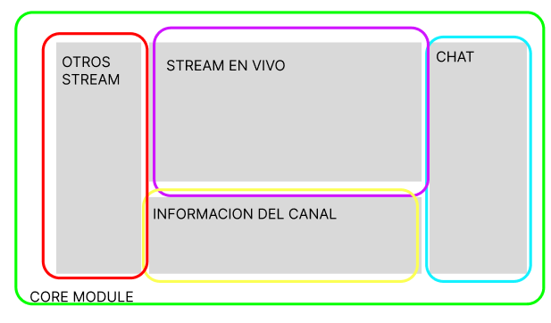

# Angular

**Creador**: Google

Angular es un marco de diseño de aplicaciones y una **plataforma de desarrollo** diseñada para crear aplicaciones de una sola página altamente eficientes y sofisticadas.

## Plataforma

Angular es una plataforma completa que incluye:

* **Angular CLI**: Una potente interfaz de línea de comandos que simplifica la creación y gestión de proyectos de Angular.
* **Angular Material**: Una biblioteca de componentes y estilos diseñada para facilitar la creación de interfaces de usuario atractivas y consistentes.
* **Angular Universal**: Esta característica permite el renderizado del lado del servidor (SSR), lo que significa que en lugar de tener una aplicación de una sola página (SPA), puedes servir tus componentes directamente desde el servidor. Esto mejora la optimización para motores de búsqueda (SEO) y el rendimiento de la aplicación.

Angular es una plataforma completa que proporciona todas las herramientas necesarias para desarrollar aplicaciones web de alta calidad.

## Framework

Es una coleccion de librerias.

Angular también se puede considerar un **framework**, que es una colección de librerías y herramientas que simplifican el proceso de desarrollo de aplicaciones. Estas librerías y herramientas incluyen funcionalidades esenciales para la creación de aplicaciones web, como el enrutamiento, la gestión de formularios y la manipulación eficiente del DOM.

## Librería

Es codigo de terceros que nosotros utilizamos dia a dia para brindar soluciones.

Dentro de Angular, encontrarás numerosas librerías que son esenciales para construir aplicaciones. Estas librerías son conjuntos de código de terceros que se utilizan diariamente para brindar soluciones a problemas comunes en el desarrollo de aplicaciones web.

# Angular es una plataforma

**Angular Core** es un componente fundamental de Angular. Sirve como un marco estructural que emplea directivas para organizar y dar estructura a una aplicación. Las directivas son un elemento esencial en Angular y proporcionan funcionalidades adicionales a los elementos del DOM. Esto posibilita la creación de una experiencia de usuario dinámica y enriquecedora.

Por ejemplo:
```js
<div ng-If ng-For></div>
```

## Módulos

> Para las nuevas versiones de Angular los módulos estarán deprecados

Los modulos es una forma de estructurar nuestra aplicaciones



En Angular, los módulos son elementos esenciales para la organización de una aplicación. Para ilustrar este concepto, tomemos la interfaz de usuario de Twitch como ejemplo. En esta aplicación, identificamos varios módulos, también conocidos como **características (features)**:

* **Módulo de "Stream en Vivo"**: Gestiona la funcionalidad relacionada con las transmisiones en vivo, como la reproducción de video y la interacción en tiempo real.
* **Módulo de "Chat"**: Controla las capacidades del chat, incluyendo la entrada de mensajes, el manejo de nombres de usuario, colores y tipografía.
* **Módulo de "Otros Streamers"**: Administra la sección que muestra otros streamers en vivo y proporciona la funcionalidad necesaria para acceder a esas transmisiones.
* **Módulo de "Información del Canal"**: Ofrece información detallada sobre el canal de Twitch, como estadísticas, descripciones y enlaces relacionados.

Además de estos módulos, Angular introduce el concepto del **Módulo Principal (Core Module)**. El Core Module actúa como un envoltorio para todos estos módulos, proporcionando una estructura organizativa fundamental para la aplicación.

Un componente o característica Angular no puede existir ni funcionar sin sus dependencias. Por ejemplo, el módulo de "Chat" requiere elementos como la entrada de mensajes, nombres de usuario, colores y tipografía para ofrecer su funcionalidad completa. Cuando estas características son compartidas entre diferentes módulos, creamos un **Módulo Compartido (Shared Module)**.

En un Módulo Compartido, incluimos cualquier elemento que pueda ser utilizado en múltiples módulos. Esto podría abarcar desde componentes, servicios hasta directivas personalizadas. Por ejemplo, un componente de entrada de mensajes puede residir en un Shared Module, ya que podría ser empleado en diversos lugares de la aplicación, no limitándose únicamente al módulo de "Chat".

Entonces: Resumiendo...

1. **Módulo (module) en Angular**
   Un módulo en Angular es una estructura que agrupa componentes, servicios, directivas y otros elementos relacionados que funcionan juntos para cumplir con una funcionalidad específica en una aplicación. Los módulos ayudan a organizar y modularizar el código de una aplicación, lo que facilita la gestión y escalabilidad del proyecto. Cada componente debe estar declarado en un módulo y los módulos se utilizan para dividir la aplicación en partes lógicas y reutilizables.
2. **Core Module (Módulo Principal o Núcleo)**
   El Core Module en Angular es un módulo especial que se utiliza para almacenar componentes, servicios y otros recursos que son compartidos de manera global en toda la aplicación. Contiene elementos que son esenciales para el funcionamiento central de la aplicación, como servicios de autenticación, servicios de datos globales o directivas personalizadas utilizadas en toda la aplicación. El Core Module ayuda a mantener un alto nivel de cohesión en la aplicación y facilita la gestión de dependencias.
3. **Shared Module (Módulo Compartido)**
   El Shared Module en Angular es un módulo utilizado para agrupar componentes, directivas, pipes y otros recursos que se utilizan en múltiples partes de la aplicación. Estos recursos son compartidos entre diferentes módulos para promover la reutilización de código y reducir la duplicación. Un Shared Module puede contener componentes comunes, directivas personalizadas, pipes personalizados y otros elementos que no están ligados a una característica o módulo específico, lo que facilita su uso en toda la aplicación. Esto contribuye a mantener un código más limpio y organizado.

# Revolución de Angular desde la versión 16

La revolucion comienza con los **standalone components**, gracias a esto los modulos estan desapareciendo, o bueno eso es lo que nos hacen creer

Un componente tiene que estar en un módulo ¿Por qué? Pues porque todas las dependencias debían de estar en el modulo. Entonces lo que se tenia era que un componente tenia que estar en un modulo y las dependencias debia de estar en el modulo tambien para que pueda funcionar el componente, con los standalone components se elmina el intermediario es decir a los modulos, y las dependencias defrente apuntan a los componentes, eso es un standalone component

Pero no es tan asi, lo que en realidad pasa es que nos permite obviar crear un module para el componente, esto por que implicitamente cada componente ya tiene su propio modulo, es decir declaramos nuestro componente y ya no escribimos el modulo

> Otra cosa que cambiaran en los componenetes seran los decoradores, mas adelante se verá esto

**VENTAJAS:**

* Estructura
* Robusto
* Requerimientos bien definidos
* Opinado: quiere decir que la comunidad rige el camino del framework

**DESVENTAJAS:**

* Curva de aprendizaje: esto por que angular no es un framework sino una plataforma
  * Service: un fichero el cual contiene información estable, es singleton
* Requerimientos cambiantes (si trabajamos una startup por ejemplo)
* Verborrajico: para crear un componente tiene que seguir varios pasos Modulo -> Depend -> Componente -> (selector, ...)

Con la version 16 en adelante se esta tratando de simplificar la curva de aprendizaje, mejorar la documentacion, mejorando la calidad de desarrollo,asi que mejora los requerimientos cambiantes


Continuando... A parte de los **Standalone components** se introdujo un nuevo concepto:

## ESMODULES

Estamos trabajando directamente con un compilador que trabaja sobre los modulos de ecmascript eso quiere decir que por detras usamos **ViteJS**
* más rapido
* meter plugins mucho más facil, etc

## Signals

Angular 16 ya provee signals? No, signals viene como solucion porque la comunidad de angular dice que RxJS es muy complicado entonces quieren sacar signals enfavor de RxJS, entoces signals es la solución para poder compartir informacion entre varios componentes de manera mucho más facil

Signals se introduce en la version 16 pero como algo como para poder agarrar y usar dentro de los componentes

En la version 17 se vienen los signals components, donde ahora si un componente podra existir fuer de la **ngzone**(que es la forma en que angular detectaba cambios y que para ultimas versiones estaba muy lento)

> ng-store

### NgZone

En Angular, NgZone es una clase que proporciona un mecanismo para gestionar la zona de Angular, que es una parte importante de la detección de cambios y el ciclo de vida de la aplicación Angular. La zona de Angular es una abstracción que se utiliza para rastrear y gestionar las operaciones asincrónicas que ocurren en una aplicación Angular, como eventos de DOM, solicitudes HTTP, temporizadores y otros.

La NgZone se utiliza para encapsular código que puede realizar operaciones asincrónicas y luego notificar a Angular cuando estas operaciones han terminado. Esto es especialmente importante porque Angular utiliza el mecanismo de "detección de cambios" para saber cuándo actualizar la vista y mantener los datos sincronizados con el modelo. Si se realizan operaciones asincrónicas fuera de la zona de Angular, Angular puede no ser consciente de los cambios y no actualizará la vista correctamente.

Aquí hay un ejemplo de cómo se utiliza NgZone en Angular:

```ts
import { Component, NgZone } from '@angular/core';

@Component({
  selector: 'app-example',
  template: '<button (click)="doSomethingAsync()">Click Me</button>',
})
export class ExampleComponent {
  constructor(private ngZone: NgZone) {}

  doSomethingAsync() {
    this.ngZone.run(() => {
      // Código que realiza operaciones asincrónicas
      // Angular se enterará de estas operaciones y actualizará la vista cuando sea necesario
    });
  }
}
```

En el ejemplo anterior, this.ngZone.run() se utiliza para asegurarse de que las operaciones asincrónicas dentro de la función se ejecuten dentro de la zona de Angular. Esto garantiza que Angular esté al tanto de cualquier cambio y pueda actualizar la vista de manera adecuada.

En resumen, NgZone es una herramienta importante en Angular para asegurarse de que las operaciones asincrónicas se gestionen correctamente en la aplicación y que Angular esté informado de los cambios para mantener la vista sincronizada con los datos.

### NgRx Store

NgRx es una biblioteca de gestión de estado inspirada en Redux, que se utiliza para administrar el estado de una aplicación Angular de una manera más controlada y predecible. El "store" en NgRx Store es un almacén centralizado que contiene el estado de la aplicación y se actualiza a través de acciones. Los componentes de la aplicación pueden leer datos del "store" y despachar acciones para realizar cambios en el estado.

## Directivas

Las directivas eran muy dificiles para los que recien empezaban, lo que ahora estan implementando son los **template syntax** porque se piensa que la curva de aprendizaje con las directivas es muy complicado ya que existen demasiadas directivas un ejemplo de las **template syntax** sería:
```ts
{#if ...
  ...
}
```
> Es una forma parecida a como se usa en svelte

**PROBLEMAS QUE TENÍAN LAS DIRECTIVAS:**

las directivas tienen como una regla: **1 directiva por tag de html**

que pasa si tenemos un div

```html
<div > -> ng-if: render de coleccion
       -> ng-for: items que mostrar
```

Normalamente lo solucionariamos asi
```html
ng-container - ng-if
  <div ng-for>
```
El **ng-container** no se renderiza

Tenemos tambien el **ng-template** que hace referencia a otra estructura html, se comunican con los `#id-identificador` 

## Testing 

Antes se usa usaba Karma y Jasmine que son tecnologías antiguas: Los que se viene es **JEST** 


**_Lo que quiere Angular es simplicar la vida al desarrollador_**


# Angular Universal

Nos ayuda en el trabajo de **SSR**, 

Angular universal usa universal rendering

Renderiza el componente primero desde el servidor y despues lo reenderiza desde el cliente y eso hace que la pantalla haga un flickering (la pantalla parpadeante)

Integracion inmediata de SSR, los proyectos bancarios iran de una mejor manera

# Angular Way

A diferencia de React que posee diferentes soluciones para un problema, angular solo tendra un solo camino para solucionar esos problemas es eso el **Angular Way**


Algunos conceptos clave del "Angular Way"

1. **Componentes:** En Angular, la interfaz de usuario se organiza en componentes. Cada componente es una unidad independiente y reutilizable que encapsula la lógica y la presentación relacionadas.
2. **Módulos:** Los módulos se utilizan para organizar y encapsular funcionalidades relacionadas en una aplicación Angular. Cada aplicación Angular tiene al menos un módulo principal (AppModule) y puede tener módulos secundarios para organizar funcionalidades específicas.
3. **Directivas:** Las directivas son instrucciones en el HTML que permiten extender y modificar el comportamiento del DOM. Angular proporciona directivas integradas como ngIf, ngFor, y también permite crear directivas personalizadas.
4. **Inyección de Dependencias:** Angular utiliza un sistema de inyección de dependencias para proporcionar servicios y otros objetos a componentes de manera eficiente y controlada.
5. **Rutas y Enrutamiento:** Angular proporciona un enrutador que permite crear aplicaciones de una sola página (SPA) y navegar entre diferentes vistas de manera eficiente.
6. **Observables y Programación Reactiva:** Angular favorece el uso de RxJS (una biblioteca de programación reactiva) y observables para manejar flujos de datos asincrónicos y eventos.
7. **Detección de Cambios:** Angular realiza un seguimiento de los cambios en los datos y actualiza automáticamente la vista cuando se producen cambios.
8. **Testing:** Angular facilita la escritura de pruebas unitarias y de integración para garantizar la calidad y el rendimiento de la aplicación.
9. **TypeScript:** Angular se basa en TypeScript, un superconjunto de JavaScript que agrega tipado estático y otras características avanzadas.


