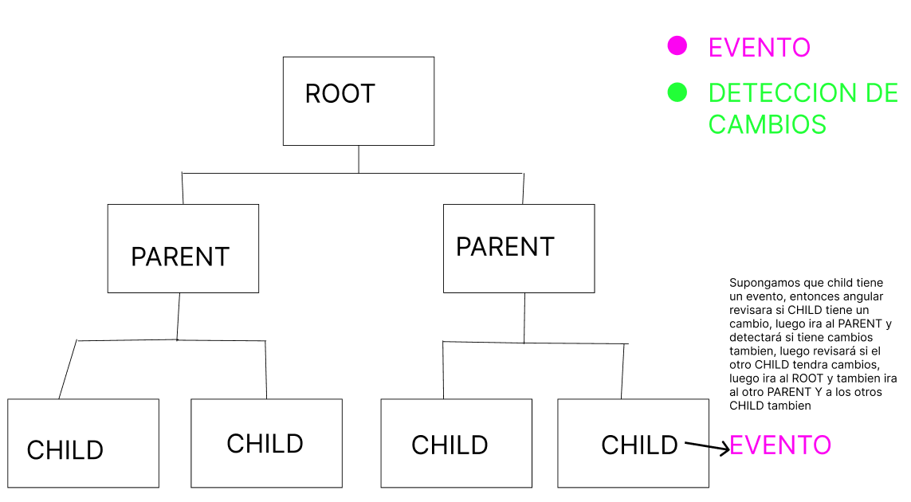
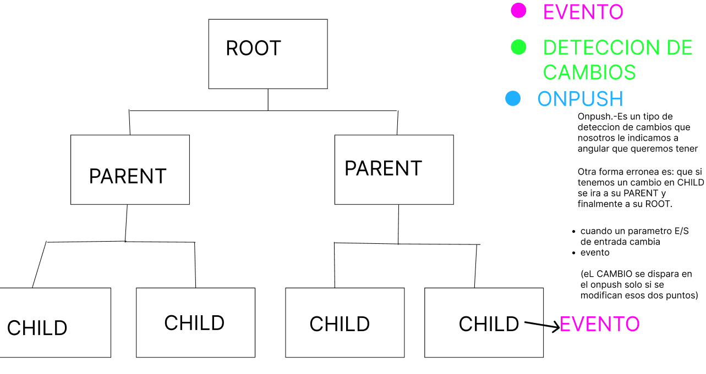

# Rendering y Deteccion de cambios

## Detección de Cambios

Zone.js

¿Para que sirve?

Es una lógica que se encarga de la detección de cambios

State

Angular dice que hay 3 cosas que hacen que suceda un render:
1. Cualquier operación asyncrona
2. Cualquier tipo de operacion que venga en el network (request)
3. Eventos - click - keydown - etc

```
Nosotros estamos trabajando en nuestro codigo pero hay cosas
que nosotros no queremos que angular lo tome como cambios,
puede ser que nosotros estemos trabajando en un settimeout, setinterval
entonces nosotros podemos usar una dependencia para que no lo tome como un cambio:
Ejemplo:

Cada componente tiene un constructor:
constructor (ngZone: NgZone)
  ngZone.runOutsideAngular()
```

Algunos ejemplos con el Zone.js

### 1. Detección de cambios

Una de las características más importantes de Zone.js en Angular es su papel en la detección de cambios. Angular utiliza las zonas para saber cuándo realizar una verificación de cambios y actualizar la vista. Esto es especialmente útil en la programación reactiva y en la manipulación del DOM.

Ejemplo:

Supongamos que tienes un componente Angular simple que muestra un contador y un botón para aumentar ese contador. Aquí tienes el código del componente:

```ts
import { Component } from '@angular/core';

@Component({
  selector: 'app-counter',
  template: `
    <button (click)="increment()">Increment</button>
    <p>Counter: {{ counter }}</p>
  `,
})
export class CounterComponent {
  counter = 0;

  increment() {
    this.counter++;
  }
}
```

En este caso, cuando haces clic en el botón "Increment," el valor del contador se incrementa, y Zone.js detecta este cambio en el modelo de datos y actualiza la vista automáticamente. Esto es posible gracias a Zone.js.

### 2. Manejo de errores

Zone.js también facilita la captura y el manejo de errores en aplicaciones Angular. Puedes definir una zona específica para capturar y manejar errores de manera consistente en toda la aplicación.

Ejemplo:

Supongamos que tienes un servicio que realiza una solicitud HTTP y quieres capturar y manejar errores de manera centralizada en tu aplicación. Puedes definir una zona para hacerlo:

```ts
import { Injectable, NgZone } from '@angular/core';
import { HttpClient } from '@angular/common/http';

@Injectable()
export class MyService {
  constructor(private http: HttpClient, private ngZone: NgZone) {}

  makeHttpRequest() {
    this.ngZone.run(() => {
      this.http.get('https://api.example.com/data').subscribe(
        (response) => {
          // Procesar la respuesta exitosa
        },
        (error) => {
          // Manejar el error
          console.error('Error en la solicitud HTTP:', error);
        }
      );
    });
  }
}
```

En este ejemplo, estamos utilizando this.ngZone.run() para ejecutar la solicitud HTTP dentro de una zona específica, lo que permite capturar y manejar errores de manera más consistente.

### 3. Cambios Asíncronos

Zone.js también es útil cuando trabajas con tareas asíncronas como `setTimeout`, `setInterval`, y `Promise`. Asegura que los cambios en el estado de la aplicación se reflejen en la vista en el momento adecuado.

Ejemplo:
Supongamos que tienes un componente que usa `setTimeout` para actualizar un mensaje después de un retraso.

```ts
import { Component, NgZone } from '@angular/core';

@Component({
  selector: 'app-timer',
  template: `
    <p>{{ message }}</p>
  `,
})
export class TimerComponent {
  message = 'Initial message';

  constructor(private ngZone: NgZone) {}

  ngOnInit() {
    this.ngZone.runOutsideAngular(() => {
      setTimeout(() => {
        this.message = 'Updated message after delay';
      }, 2000);
    });
  }
}
```
En este caso, estamos utilizando this.ngZone.runOutsideAngular() para ejecutar el código dentro de la zona exterior, lo que permite que Zone.js rastree el cambio en message y actualice la vista correctamente después del retraso.

## Optimización

**Computos lentos version chatgpt**

Los problemas de rendimiento en aplicaciones Angular pueden ser causados por diversas razones, y es importante identificar la causa subyacente para abordarlos de manera efectiva. Aquí hay algunas posibles razones por las que una aplicación Angular podría experimentar un rendimiento lento y cómo solucionarlos:

1. **Demasiadas operaciones de detección de cambios**: Angular realiza la detección de cambios para mantener actualizada la vista en función de los cambios en el modelo de datos. Si tienes un gran número de componentes o una estructura de componentes anidados compleja, esto puede llevar a un exceso de detección de cambios y reducir el rendimiento. Para abordar esto:
   1. **Estrategia OnPush** Utiliza la estrategia de detección de cambios OnPush en componentes cuando sea posible para reducir la frecuencia de detección de cambios.
   2. Utiliza la directiva ***ngFor** de manera eficiente, evitando operaciones costosas en las iteraciones.
   3. Divide la aplicación en módulos y carga perezosamente módulos que no se utilizan en la página principal.
2. **Carga excesiva de datos:** Si estás recuperando grandes cantidades de datos de una API o base de datos, la carga de datos puede ser lenta y afectar negativamente el rendimiento. Aquí tienes algunas soluciones:
   1. Implementa paginación o carga progresiva para dividir grandes conjuntos de datos en partes más pequeñas.
   2. Utiliza memoización o caché para almacenar en memoria datos que se acceden con frecuencia.
3. **Operaciones de renderizado ineficientes:** El renderizado ineficiente de componentes, especialmente cuando se usan directivas estructurales como *ngIf, puede causar problemas de rendimiento. Para solucionar esto:
   1. Utiliza la directiva `*ngIf` con moderación y evita anidar directivas `*ngIf`.
   2. Utiliza `ng-container` para evitar agregar elementos HTML innecesarios al DOM.
4. **Solicitud de recursos ineficiente:** Las solicitudes HTTP lentas o la carga de recursos como imágenes y archivos pueden ralentizar la aplicación. Puedes mejorar esto:
   1. Implementa técnicas de optimización de imágenes, como compresión y carga diferida.
   2. Utiliza la compresión Gzip o Brotli en el servidor para acelerar la entrega de archivos estáticos.
5. **Falta de optimización del ciclo de vida:** Asegúrate de comprender y utilizar eficazmente los ganchos del ciclo de vida de Angular (como **ngOnInit**, **ngOnChanges**, **ngDoCheck**, etc.) para evitar ejecuciones innecesarias de código.
6. **Bucle infinito o bloqueo del hilo principal:** Es posible que alguna parte de tu código esté causando un bucle infinito o bloqueando el hilo principal, lo que haría que la aplicación parezca lenta. Debes revisar tus funciones y servicios en busca de problemas de rendimiento.
7. **Optimización asincrónica:** Utiliza técnicas asincrónicas como la carga diferida (**Lazy Loading**) de módulos y la programación reactiva (RxJS) para evitar bloqueos en la interfaz de usuario mientras se realizan operaciones costosas.
8. **Pruebas de rendimiento:** Utiliza herramientas de desarrollo y pruebas de rendimiento como Chrome DevTools y Lighthouse para identificar cuellos de botella de rendimiento y áreas de mejora en tu aplicación Angular.

**Computos lentos version gentleman**

- Angular evalua expresiones que hay en el template 
- ngDoCheck, ngAfterContentChecked, ngAfterViewChecked, ngOnChanges

Soluciones:

1. Si tenemos un computo lento, puede que sea por nuestra logica en el algoritmo
2. Utilizar caching (guardar los resultados)
   ```html
   <!-- Angular lo que tiene son los pipes -->
   <div> {{dinero | currency}} </div> <!-- 10$ -->

   <!-- Existe otro tipo de pipe que es el puro, que funciona -->
   <!-- cada que el valor cambie, y lo optimiza con el pure pipe -->
   ```

   El caching en Angular, en el contexto de los pipes, se refiere a la capacidad de almacenar en caché los resultados de un pipe para evitar cálculos innecesarios cada vez que se realiza una interpolación en la plantilla. En Angular, los pipes son por defecto "puros" (pure pipes), lo que significa que se ejecutan solo cuando sus argumentos cambian. Esto permite un comportamiento de caché automático, ya que los resultados se almacenan en caché hasta que los argumentos cambian.

   En tu ejemplo, estás utilizando el pipe currency para formatear la variable dinero como una cantidad de dinero. Si el valor de dinero no cambia entre las actualizaciones de la vista, Angular automáticamente almacena en caché el resultado del pipe currency.

   Por ejemplo:
   ```html
   <div>{{ dinero | currency }}</div>
   ```

   Si dinero tiene un valor de 100, la primera vez que se renderiza la vista, Angular aplicará el pipe currency para formatear 100 como una cantidad de dinero y mostrará el resultado. Sin embargo, si no cambias el valor de dinero, Angular no volverá a aplicar el pipe currency en las actualizaciones posteriores de la vista. En cambio, reutilizará el resultado almacenado en caché para evitar la sobrecarga de cálculos innecesarios.

   Este comportamiento es una ventaja de los pipes puros en Angular, ya que aseguran que no se realicen transformaciones costosas en cada ciclo de detección de cambios, a menos que los datos de entrada cambien.

3. Memoization: Es lo mismo que la pure pipe, solo que aqui se puede guardar mas de un valor, se puede poner mas logica tambien.

    **_Entendiendo el concepto de memoizacion_**

    La memoización es una técnica de optimización que se utiliza en programación para almacenar en caché los resultados de una función costosa, de modo que si la función se llama nuevamente con los mismos argumentos, en lugar de calcular el resultado nuevamente, se devuelve el valor almacenado en caché. Esto puede mejorar significativamente el rendimiento al evitar cálculos redundantes. Aquí tienes una explicación más detallada con ejemplos en JavaScript.

    Ejemplo:

    Supongamos que tienes una función costosa que calcula el factorial de un número:

    ```js
    function calcularFactorial(n) {
      if (n === 0) {
        return 1;
      } else {
        return n * calcularFactorial(n - 1);
      }
    }
    ```
    Sin memoización, si llamamos a `calcularFactorial(5)` y luego `calcularFactorial(5)` de nuevo, se realizarán los mismos cálculos cada vez. Con memoización, podemos evitar esto almacenando en caché los resultados:
    ```js
    const memo = {};

    function calcularFactorialMemoizado(n) {
      if (n === 0) {
        return 1;
      }
      
      if (memo[n]) {
        return memo[n];
      } else {
        memo[n] = n * calcularFactorialMemoizado(n - 1);
        return memo[n];
      }
    }
    ```
    En este ejemplo, hemos creado un objeto memo para almacenar en caché los resultados de la función. Cuando llamamos a calcularFactorialMemoizado(5) por primera vez, calcula y almacena el resultado en memo. Cuando lo llamamos de nuevo con el mismo argumento, simplemente devuelve el valor almacenado en memo, evitando así el cálculo repetido.

    ***Memoizacion en Angular***

    La memoización en Angular es una técnica que se puede utilizar en combinación con los pipes puros (pure pipes) para optimizar el rendimiento de una aplicación Angular. Aunque los pipes puros ya están diseñados para ser eficientes, la memoización puede ser especialmente útil cuando se trabaja con datos costosos de calcular o transformar.

    Primero, permíteme explicar los conceptos clave:

    a. **Pipes puros (Pure Pipes):** Los pipes puros son una característica de Angular que permite la transformación eficiente de datos en la plantilla de un componente. Los pipes puros se ejecutan solo cuando los valores de entrada cambian. Esto significa que si un valor de entrada es el mismo en llamadas consecutivas, el pipe puro no se volverá a ejecutar, ya que Angular asume que el resultado no cambiará. Esto es similar al concepto de memoización, donde los resultados se almacenan en caché y se reutilizan si los argumentos son los mismos.
    b. **Memoización:** La memoización es una técnica que consiste en almacenar en caché (memorizar) los resultados de una función basándose en sus argumentos. Si la función se llama de nuevo con los mismos argumentos, en lugar de volver a calcular el resultado, se devuelve el valor almacenado en caché. Esto mejora el rendimiento al evitar cálculos repetidos.

    Ahora, veamos cómo la memoización y los pipes puros pueden relacionarse en una aplicación Angular:

    Ejemplo:

    Supongamos que tienes una lista de números y deseas aplicar una transformación costosa a cada número antes de mostrarlo en la vista. Puedes usar un pipe puro para hacer esto y, si es necesario, aplicar memoización para evitar cálculos innecesarios.

    ```ts
    // Pipe puro que realiza una transformación costosa
    @Pipe({
      name: 'miPipePuro',
      pure: true, // Por defecto, los pipes son puros
    })
    export class MiPipePuro implements PipeTransform {
      transform(numero: number): number {
        // Realiza una transformación costosa aquí
        return calcularTransformacionCostosa(numero);
      }
    }
    ```
    En este ejemplo, MiPipePuro es un pipe puro que realiza una transformación costosa en función del número de entrada. Dado que es un pipe puro, Angular automáticamente se asegura de que solo se ejecute cuando el número de entrada cambia.

    Si deseas aplicar memoización para evitar cálculos repetidos de la misma transformación costosa, puedes hacerlo en la función calcularTransformacionCostosa:

    ```ts
    const memo = new Map<number, number>();

    function calcularTransformacionCostosa(numero: number): number {
      if (memo.has(numero)) {
        // Devolver el resultado almacenado en caché
        return memo.get(numero);
      }

      // Realizar el cálculo costoso
      const resultado = /* Realizar la transformación costosa aquí */;

      // Almacenar el resultado en caché
      memo.set(numero, resultado);

      return resultado;
    }
    ```
    En este caso, hemos creado una función calcularTransformacionCostosa que aplica la memoización utilizando un Map para almacenar en caché los resultados. Si se llama a la función con el mismo número nuevamente, en lugar de realizar el cálculo costoso, se devuelve el resultado almacenado en caché.

    Así, la combinación de pipes puros y memoización puede ser beneficiosa cuando necesitas transformar datos de manera eficiente y evitar cálculos innecesarios en una aplicación Angular.

4. Tratar de que no haya renders cuando no queremos.
   
   La optimización de los renders en Angular es una parte fundamental para garantizar un alto rendimiento en tu aplicación web. A continuación, te proporcionaré algunas estrategias y técnicas para manejar los renders de manera eficiente en Angular:
   1. **Change Detection OnPush:** Utiliza la estrategia de detección de cambios OnPush para tus componentes siempre que sea posible. Esta estrategia garantiza que la detección de cambios solo se realice cuando las referencias a las entradas del componente cambian. Esto reduce la frecuencia de las verificaciones de cambios y, por lo tanto, mejora el rendimiento. Puedes configurar un componente con OnPush de la siguiente manera:
   ```ts
   @Component({
     selector: 'app-ejemplo',
     templateUrl: 'ejemplo.component.html',
     changeDetection: ChangeDetectionStrategy.OnPush
   })
   ```
   2. **Async Pipe:** Utiliza el pipe async para manejar las suscripciones a observables o promesas directamente en la plantilla. El async pipe se encarga automáticamente de suscribirse y anular la suscripción cuando el componente se destruye. Esto evita pérdidas de memoria y reduce la complejidad del código relacionado con las suscripciones.
   ```htm
   <div>{{ datosObservable | async }}</div>
   ```
   3. **ngFor TrackBy:** Cuando utilices la directiva *ngFor, asegúrate de proporcionar una función trackBy que identifique de manera única los elementos en la lista. Esto evita que Angular vuelva a renderizar elementos que no han cambiado.
   ```html
   <div *ngFor="let item of items; trackBy: trackByFn">{{ item }}</div>
   ```
   ```ts
   trackByFn(index, item) {
     return item.id; // Utiliza un identificador único en lugar del índice si es posible
   }
   ```
   4. **Lazy Loading:** Divide tu aplicación en módulos y utiliza la carga perezosa (Lazy Loading) para cargar solo los módulos necesarios cuando se acceden a rutas específicas. Esto reduce la carga inicial de la aplicación y mejora el tiempo de inicio.
   5. **Angular Universal:** Si tu aplicación es de una sola página (SPA), considera la posibilidad de implementar Angular Universal para la representación en el lado del servidor (SSR). Esto puede mejorar significativamente el rendimiento y la indexación de motores de búsqueda.
   6. **Optimización de imágenes y recursos:** Comprime y optimiza imágenes y recursos estáticos para reducir los tiempos de carga de la aplicación. Utiliza herramientas como WebP para imágenes y técnicas de minificación para archivos CSS y JavaScript.
   7. **Tree Shaking:** Asegúrate de que tu aplicación Angular esté configurada para realizar "tree shaking" durante la construcción, lo que elimina automáticamente el código no utilizado del paquete final.
   8. **Zonas de Cambio Controlado (Controlled Change Zones):** Utiliza zonas (Zone.js) para controlar y optimizar las áreas críticas de tu aplicación donde se pueden producir cambios frecuentes. Esto puede ayudar a reducir la sobrecarga de la detección de cambios en partes específicas de la aplicación.


## Entendiendo la detección de cambios



La detección de cambios en Angular es un mecanismo fundamental que la plataforma utiliza para mantener actualizada la vista de una aplicación web en respuesta a cambios en el modelo de datos. Entender cómo funciona este proceso es crucial para desarrollar aplicaciones Angular eficientes y evitar problemas de rendimiento. Aquí tienes una explicación más detallada sobre la detección de cambios en Angular:

**¿Qué es la Detección de Cambios en Angular?**

La detección de cambios es un proceso automático en Angular que rastrea las modificaciones en las propiedades y estados de los componentes y actualiza la vista de manera eficiente en función de estos cambios. Cuando un componente o un servicio actualiza sus datos o estados, Angular verifica y compara el estado actual con el estado anterior para determinar qué partes de la vista necesitan actualizarse.

**Ciclo de Detección de Cambios en Angular**

El ciclo de detección de cambios en Angular se ejecuta automáticamente y consta de varios pasos:

1. **Iniciación:** El ciclo de detección de cambios comienza cuando se dispara algún evento en la aplicación que podría cambiar el modelo de datos. Esto podría ser un evento de usuario como hacer clic en un botón, recibir datos de una solicitud HTTP o cambios en las propiedades de un componente.
2. **Comprobación de Detalles:** Angular verifica todos los componentes y directivas en la aplicación para ver si han cambiado sus propiedades o estados. Esto se hace utilizando zonas (Zone.js), que envuelven las operaciones asincrónicas y permiten rastrear las ejecuciones de las funciones.
3. **Actualización de la Vista:** Una vez que se detectan cambios, Angular actualiza la vista para reflejar el nuevo estado de los datos. Esto implica modificar el DOM según sea necesario para que coincida con los cambios en el modelo.
4. **Finalización:** Después de actualizar la vista, Angular realiza algunas tareas adicionales, como la destrucción de componentes que ya no son necesarios o la eliminación de eventos y suscripciones a observables para evitar pérdidas de memoria.

**ESTRATEGIAS DE DETECCION DE CAMBIOS**

Angular ofrece dos estrategias de detección de cambios principales:

### 1. Default (Por defecto)

En esta estrategia, todos los componentes se someten a una detección de cambios cada vez que ocurre un evento, independientemente de si sus propiedades o estados han cambiado. Esto es adecuado para aplicaciones pequeñas o cuando se necesita un comportamiento específico de actualización en tiempo real.

### 2. Onpush

Esta estrategia solo inicia la detección de cambios en un componente cuando sus entradas (inputs) cambian o cuando se emite un evento desde ese componente. Esto reduce la sobrecarga de la detección de cambios y mejora el rendimiento en aplicaciones más grandes. Puedes configurar un componente para utilizar esta estrategia mediante `changeDetection: ChangeDetectionStrategy.OnPush`.




La estrategia de detección de cambios OnPush en Angular es una opción que puedes configurar en tus componentes para optimizar el rendimiento y reducir la sobrecarga de la detección de cambios. Cuando se aplica la estrategia OnPush, los componentes solo se vuelven a renderizar si sus entradas (inputs) cambian o si se dispara un evento dentro de ellos. Esto significa que si un componente no recibe nuevas entradas y no dispara eventos, la detección de cambios en ese componente se salta, lo que mejora significativamente el rendimiento en aplicaciones grandes y complejas.

A continuación, te explicaré cómo usar OnPush con ejemplos:

Para configurar la estrategia OnPush, debes configurar el componente en su metadatos con changeDetection: ChangeDetectionStrategy.OnPush, como se muestra a continuación:

```ts
import { Component, ChangeDetectionStrategy } from '@angular/core';

@Component({
  selector: 'app-ejemplo',
  templateUrl: 'ejemplo.component.html',
  changeDetection: ChangeDetectionStrategy.OnPush, // Configura OnPush
})
export class EjemploComponent {
  // Propiedades y métodos del componente
}
```

A continuación, te presentaré algunos ejemplos que demuestran cómo funciona OnPush:

**Ejemplo 1: Componente con OnPush y Entrada**

Supongamos que tienes un componente MensajeComponent que muestra un mensaje basado en una entrada mensaje:

```ts
import { Component, Input, ChangeDetectionStrategy } from '@angular/core';

@Component({
  selector: 'app-mensaje',
  template: '<p>{{ mensaje }}</p>',
  changeDetection: ChangeDetectionStrategy.OnPush, // Configura OnPush
})
export class MensajeComponent {
  @Input() mensaje: string;
}
```

Dado que hemos configurado este componente con OnPush, solo se volverá a renderizar cuando cambie la entrada mensaje.

**Ejemplo 2: Componente con OnPush y Evento**

Supongamos que tienes un componente ContadorComponent que muestra un contador y tiene un botón para incrementar ese contador:

```ts
import { Component, Output, EventEmitter, ChangeDetectionStrategy } from '@angular/core';

@Component({
  selector: 'app-contador',
  template: `
    <p>Contador: {{ contador }}</p>
    <button (click)="incrementar()">Incrementar</button>
  `,
  changeDetection: ChangeDetectionStrategy.OnPush, // Configura OnPush
})
export class ContadorComponent {
  contador = 0;

  @Output() incrementado = new EventEmitter<void>();

  incrementar() {
    this.contador++;
    this.incrementado.emit();
  }
}
```
Dado que hemos configurado este componente con OnPush, solo se volverá a renderizar cuando se dispare el evento `incrementado`.

#### Beneficios del OnPush

La estrategia OnPush ofrece varios beneficios:

* **Mejora del rendimiento:** Al reducir la cantidad de detecciones de cambios, `OnPush` mejora significativamente el rendimiento, especialmente en aplicaciones con una gran cantidad de componentes y actualizaciones frecuentes. 
* **Predecibilidad:** La estrategia `OnPush` hace que el comportamiento de la detección de cambios sea más predecible, ya que solo se activa en ciertas condiciones específicas, como cambios en entradas o eventos personalizados.
* **Fácil rastreo de problemas:** Cuando se utiliza `OnPush`, es más fácil rastrear las actualizaciones de los componentes, ya que solo ocurren en situaciones predefinidas. Esto puede facilitar la depuración.

Sin embargo, es importante recordar que OnPush no es una solución universal y debe utilizarse con cuidado. Debes considerar cuidadosamente si tus componentes cumplen con las condiciones para beneficiarse de esta estrategia y asegurarte de que las actualizaciones necesarias aún se realicen cuando sea necesario.

```
onPush

solamente podre detectar:
- eventos
- cambios en los parametros de entrada y salida del componente

¿Podemos cambiar eso?
  SI

Para cambiar en el constructor aumentamos el `changeDetectorRef: cd`

cd.detectChanges -> en la linea que le digamos hay cambios
cd.markForChanges -> marcalo para que al finalizar digas que hubo un cambio

> Esto esta bueno para los Observables
```

### Otros.- Manual Detección de Cambios:
Aunque Angular gestiona la detección de cambios automáticamente en la mayoría de los casos, hay situaciones en las que puedes necesitar realizar la detección de cambios manualmente utilizando el servicio ChangeDetectorRef. Esto puede ser útil en escenarios avanzados o cuando trabajas con componentes que no siguen la estrategia OnPush.


# CODEANDO

## Uso del OnPush

### 1ERA FORMA

Cuando la propiedad cambia `this.text`

Componente app.component (Root)

```ts
import { ChangeDetectionStrategy, Component } from '@angular/core';
import { CommonModule } from '@angular/common';
import { RouterOutlet } from '@angular/router';
import { TestComponent } from './test/test.component';
import { DashboardComponent } from './dashboard/dashboard.component';

@Component({
  selector: 'app-root',
  standalone: true,
  changeDetection: ChangeDetectionStrategy.OnPush,
  imports: [CommonModule, RouterOutlet, TestComponent, DashboardComponent],
  templateUrl: './app.component.html',
  styleUrls: ['./app.component.scss']
})

export class AppComponent {
  title = 'Angular00';
}
```
```html
<app-dashboard />
<router-outlet></router-outlet>
```


Componente dashboard (Parent)
```ts
import { ChangeDetectionStrategy, Component, ChangeDetectorRef } from '@angular/core';
import { CommonModule } from '@angular/common';
import { DashboardChildComponent } from './components/dashboard-child/dashboard-child.component';

@Component({
  selector: 'app-dashboard',
  standalone: true,
  changeDetection: ChangeDetectionStrategy.OnPush,
  imports: [CommonModule, DashboardChildComponent],
  templateUrl: './dashboard.component.html',
  styleUrls: ['./dashboard.component.scss']
})
export class DashboardComponent {
  text:string = 'Dashboard'

  constructor(cd: ChangeDetectorRef) {
    setTimeout(() => {
      this.text = 'dashboard text changed';
      cd.detectChanges();
    }, 5000);
  }
}
```
```html
<p>dashboard works!</p>

<app-dashboard-child [text]="text" />
```

Componente dashbord-child (Child)
```ts
import { ChangeDetectionStrategy, Component, Input, OnInit, SimpleChanges } from '@angular/core';
import { CommonModule } from '@angular/common';

@Component({
  selector: 'app-dashboard-child',
  standalone: true,
  changeDetection: ChangeDetectionStrategy.OnPush,
  imports: [CommonModule],
  templateUrl: './dashboard-child.component.html',
  styleUrls: ['./dashboard-child.component.scss']
})
export class DashboardChildComponent implements OnInit {
  @Input() text: string = '';

  constructor() {
  }

  ngOnChanges(changes: SimpleChanges) {
    console.log('Se cambio el dashboard child')
  }

  ngOnInit(): void {
    // Cuando el componente se inicializa
    console.log('Se inicializó el dashboard-child')
  }
}
```
```html
<p>{{text}}</p>
<p>dashboard-child works!</p>
```

### 2DA FORMA

Mediante el evento `(click)=handleClick()`

Componente dashboard (Parent)
```ts
import { ChangeDetectionStrategy, Component, ChangeDetectorRef } from '@angular/core';
import { CommonModule } from '@angular/common';
import { DashboardChildComponent } from './components/dashboard-child/dashboard-child.component';

@Component({
  selector: 'app-dashboard',
  standalone: true,
  changeDetection: ChangeDetectionStrategy.OnPush,
  imports: [CommonModule, DashboardChildComponent],
  templateUrl: './dashboard.component.html',
  styleUrls: ['./dashboard.component.scss']
})
export class DashboardComponent {
  text:string = 'Dashboard'

  handleClick() {
    this.text = "Dashboar change text!!!"
  }
}
```
```html
<p>dashboard works!</p>

<button (click)="handleClick()"> Change Text </button>

<app-dashboard-child [text]="text" />

```