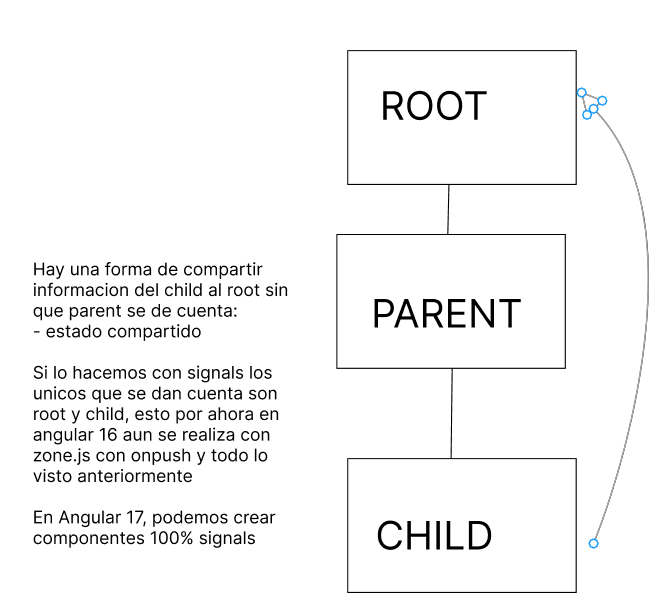

# Signals

En angular 16 se puede usar signals

Hay una forma de compartir informacion del child al root sin que parent se de cuenta:
- estado compartido

Si lo hacemos con signals los unicos que se dan cuenta son root y child, esto por ahora en angular 16 aun se realiza con zone.js con onpush y todo lo visto anteriormente

En Angular 17, podemos crear componentes 100% signals

Si aprendemos lo del zonejs es por que la mayoria de empresas no usan el angular, y siempre es necesario saber

